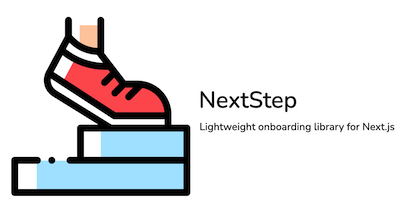

## NextStep


**NextStep** is a lightweight onboarding library for Next.js applications, inspired by [Onborda](https://github.com/uixmat/onborda). 

It utilizes [framer-motion](https://www.framer.com/motion/) for animations and [tailwindcss](https://tailwindcss.com/) for styling. 

The library allows user to use custom cards (tooltips) for easier integration.

**If you like the project, please leave a star! ⭐️⭐️⭐️⭐️⭐️**

- **[Demo App](https://nextstepjs.vercel.app)**
- **[Demo repository](https://github.com/enszrlu/NextStep-Website)**

## Getting Started

```bash
# npm
npm i nextstepjs framer-motion
# pnpm
pnpm add nextstepjs framer-motion
# yarn
yarn add nextstepjs framer-motion
# bun
bun add nextstepjs framer-motion
```

### App Router: Global `layout.tsx`
Wrap your application in `NextStepProvider` and supply the `steps` array to NextStep.

```tsx
<NextStepProvider>
  <NextStep steps={steps}>
    {children}
  </NextStep>
</NextStepProvider>
```

### Pages Router: `_app.tsx`
Wrap your application in `NextStepProvider` and supply the `steps` array to NextStep.

```tsx
<NextStepProvider>
  <NextStep steps={steps}>
    <Component {...pageProps} />
  </NextStep>
</NextStepProvider>
```

#### Troubleshooting

If you encounter an error related to module exports when using the Pages Router, it is likely due to a mismatch between ES modules (which use `export` statements) and CommonJS modules (which use `module.exports`). The `nextstepjs` package uses ES module syntax, but your Next.js project might be set up to use CommonJS.

To resolve this issue, ensure that your Next.js project is configured to support ES modules. You can do this by updating your `next.config.js` file to include the following configuration:

```tsx
/** @type {import('next').NextConfig} */
const nextConfig = {
  reactStrictMode: true,
  experimental: {
    esmExternals: true,
  },
  transpilePackages: ['nextstepjs'],
};

export default nextConfig;
```

### Tailwind Config

Tailwind CSS needs to scan the node module to include the used classes. See [configuring source paths](https://tailwindcss.com/docs/content-configuration#configuring-source-paths) for more information.


```typescript
const config: Config = {
  content: [
    './node_modules/nextstepjs/dist/**/*.{js,ts,jsx,tsx}' // Add this
  ]
}
```

### Custom Card

You can create a custom card component for greater control over the design:


| Prop          | Type             | Description                                                          |
|---------------|------------------|----------------------------------------------------------------------|
| `step`         | `Object`          | The current `Step` object from your steps array, including content, title, etc.         |
| `currentStep`   | `number`         | The index of the current step in the steps array.                    |
| `totalSteps`    | `number`         | The total number of steps in the onboarding process.                 |
| `nextStep`      |                  | A function to advance to the next step in the onboarding process.    |
| `prevStep`      |                  | A function to go back to the previous step in the onboarding process.|
| `arrow`         |                  | Returns an SVG object, the orientation is controlled by the steps side prop |
| `skipTour`         |                  | A function to skip the tour |

```tsx
"use client"
import type { CardComponentProps } from "nextstepjs";

export const CustomCard = ({
  step,
  currentStep,
  totalSteps,
  nextStep,
  prevStep,
  skipTour,
  arrow,
}: CardComponentProps) => {
  return (
    <div>
      <h1>{step.icon} {step.title}</h1>
      <h2>{currentStep} of {totalSteps}</h2>
      <p>{step.content}</p>
      <button onClick={prevStep}>Previous</button>
      <button onClick={nextStep}>Next</button>
      <button onClick={skipTour}>Skip</button>
      {arrow}
    </div>
  )
}
```

### Tours Array

NextStep supports multiple "tours", allowing you to create multiple product tours:

```tsx
import { Tour } from 'nextstepjs';

const steps : Tour[] = [
  {
    tour: "firstTour",
    steps: [
      // Step objects
    ],
  },
  {
    tour: "secondTour",
    steps: [
      // Step objects
    ],
  }
];
```

### Step Object

| Prop           | Type                          | Description                                                                           |
|----------------|-------------------------------|---------------------------------------------------------------------------------------|
| `icon`           | `React.ReactNode`, `string`, `null` | An icon or element to display alongside the step title.                                |
| `title`          | `string`                        | The title of your step                     |
| `content`        | `React.ReactNode`               | The main content or body of the step.                                                 |
| `selector`       | `string`                        | Optional. A string used to target an `id` that this step refers to. If not provided, card will be displayed in the center top of the document body.            |
| `side`           | `"top"`, `"bottom"`, `"left"`, `"right"` | Optional. Determines where the tooltip should appear relative to the selector.          |
| `showControls`   | `boolean`                       | Optional. Determines whether control buttons (next, prev) should be shown if using the default card.           |
| `showSkip`       | `boolean`                       | Optional. Determines whether skip button should be shown if using the default card.           |
| `blockKeyboardControl` | `boolean`                       | Optional. Determines whether keyboard control should be blocked|
| `pointerPadding` | `number`                        | Optional. The padding around the pointer (keyhole) highlighting the target element.             |
| `pointerRadius`  | `number`                        | Optional. The border-radius of the pointer (keyhole) highlighting the target element.           |
| `nextRoute`      | `string`                        | Optional. The route to navigate to using `next/navigation` when moving to the next step.                      |
| `prevRoute`      | `string`                        | Optional. The route to navigate to using `next/navigation` when moving to the previous step.                  |
| `viewportID`      | `string`                        | Optional. The id of the viewport element to use for positioning. If not provided, the document body will be used. **(Available after > v1.1.0)**                  |

> **Note** `NextStep` handles card cutoff from screen sides. If side is right or left and card is out of the viewport, side would be switched to `top`. If side is top or bottom and card is out of the viewport, then side would be flipped between top and bottom.

### Target Anything

Target anything in your app using the element's `id` attribute.

```tsx
<div id="nextstep-step1">Onboard Step</div>
```
### Routing During a Tour

NextStep allows you to navigate between different routes during a tour using the `nextRoute` and `prevRoute` properties in the step object. These properties enable seamless transitions between different pages or sections of your application.

- `nextRoute`: Specifies the route to navigate to when the "Next" button is clicked.
- `prevRoute`: Specifies the route to navigate to when the "Previous" button is clicked.

When `nextRoute` or `prevRoute` is provided, NextStep will use Next.js's `next/navigation` to navigate to the specified route.

### Using NextStepViewport and viewportID
**Only available after > v1.1.0**
When a selector is in a scrollable area, it is best to wrap the content of the scrollable area with `NextStepViewport`. This component takes `children` and an `id` as prop. By providing the `viewportID` to the step, NextStep will target this element within the viewport. This ensures that the step is anchored to the element even if the container is scrollable.

Here's an example of how to use `NextStepViewport`:
```tsx

    <div className="relative overflow-auto h-64">
      <NextStepViewport id="scrollable-viewport">
        {children}
      </NextStepViewport>
    </div>
```


### Example `steps`

```tsx
[
  {
    tour: "firsttour",
    steps: [
      {
        icon: <>👋</>,
        title: "Tour 1, Step 1",
        content: <>First tour, first step</>,
        selector: "#tour1-step1",
        side: "top",
        showControls: true,
        showSkip: true,
        pointerPadding: 10,
        pointerRadius: 10,
        nextRoute: "/foo",
        prevRoute: "/bar"
      },
      {
        icon: <>🎉</>,
        title: "Tour 1, Step 2",
        content: <>First tour, second step</>,
        selector: "#tour1-step2",
        side: "top",
        showControls: true,
        showSkip: true,
        pointerPadding: 10,
        pointerRadius: 10,
        viewportID: "scrollable-viewport"
      }
    ]
  },
  {
    tour: "secondtour",
    steps: [
      {
        icon: <>🚀</>,
        title: "Second tour, Step 1",
        content: <>Second tour, first step!</>,
        selector: "#nextstep-step1",
        side: "top",
        showControls: true,
        showSkip: true,
        pointerPadding: 10,
        pointerRadius: 10,
        nextRoute: "/foo",
        prevRoute: "/bar"
      }
    ]
  }
]
```

### NextStep Props

| Property | Type | Description
|-----|-----|-----
| `children` | `React.ReactNode` | Your website or application content
| `steps` | `Array[]` | Array of Tour objects defining each step of the onboarding
| `showNextStep` | `boolean` | Controls visibility of the onboarding overlay
| `shadowRgb` | `string` | RGB values for the shadow color surrounding the target area
| `shadowOpacity` | `string` | Opacity value for the shadow surrounding the target area
| `cardComponent` | `React.ComponentType` | Custom card component to replace the default one
| `cardTransition` | `Transition` | Framer Motion transition object for step transitions
| `onStepChange` | `(step: number) => void` | Callback function triggered when the step changes
| `onComplete` | `() => void` | Callback function triggered when the tour completes
| `onSkip` | `() => void` | Callback function triggered when the user skips the tour
| `clickThroughOverlay` | `boolean` | Optional. If true, overlay background is clickable, default is false


```tsx
<NextStep
  steps={steps}
  showNextStep={true}
  shadowRgb="55,48,163"
  shadowOpacity="0.8"
  cardComponent={CustomCard}
  cardTransition={{ duration: 0.5, type: "spring" }}
  onStepChange={(step) => console.log(`Step changed to ${step}`)}
  onComplete={() => console.log("Tour completed")}
  onSkip={() => console.log("Tour skipped")}
  clickThroughOverlay={false}
>
  {children}
</NextStep>
```

## useNextStep Hook

useNextStep hook allows you to control the tour from anywhere in your app.

```tsx
import { useNextStep } from 'nextstepjs';
....

const { startNextStep, closeNextStep } = useNextStep();

const onClickHandler = (tourName: string) => {
  startNextStep(tourName);
};
```

## Keyboard Navigation

NextStep supports keyboard navigation:

- Right Arrow: Next step
- Left Arrow: Previous step
- Escape: Skip tour

## Localization

NextStep is a lightweight library and does not come with localization support. However, you can easily switch between languages by supplying the `steps` array based on locale.

## Contributing

Contributions are welcome! Please feel free to submit a Pull Request.

## License

This project is licensed under the MIT License.